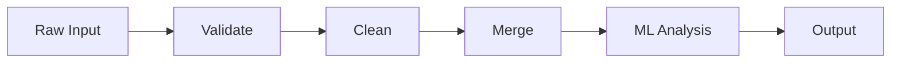

# Excel Utility Hub

A Python toolkit for validating, cleaning, merging, and analysing Excel-based data pipelines.

[](https://github.com/Dustin2304/Schema-Validator/actions/workflows/ci.yml)

---

## Problem

Excel files arriving from external sources rarely conform to what downstream code expects. Column names change, types are inconsistent, values fall outside valid ranges, and duplicates accumulate silently. Catching these problems at the point of ingestion — before any transformation or analysis runs — prevents corrupted results from propagating. This toolkit provides a structured way to declare what a DataFrame must look like and get a precise report of every deviation from that contract.

---

## Features

**Case A — Schema Validator (complete)**

- Detects missing and unexpected columns
- Flags null values in non-nullable columns, with row-level indices
- Checks Python-native types per column (int, float, str, bool)
- Enforces numeric `min_value` / `max_value` bounds; boundary values pass
- Validates against an explicit `allowed_values` list
- Returns a structured `ValidationReport` — never raises, never prints

---

## Data Flow



---

## Architecture

The codebase is split into two layers that are kept strictly separate.

`src/core/` contains all business logic: validation rules, deduplication strategies, merge logic, and ML analysis. Every function in `core/` is a pure transformation — it takes data in, returns a result, and has no side effects. There are no file reads, no prints, no database calls. This constraint means every function can be tested by constructing a `pd.DataFrame` inline; no fixtures, no mocks, no temporary files.

`src/cli/` is the only place that touches the outside world. It parses arguments, reads files, calls `core/`, and formats output. The CLI is thin by design: if logic creeps in here, it cannot be unit-tested without invoking the full process.

This separation makes the test suite fast and deterministic, and it makes it possible to add a dashboard or API adapter later without touching any core logic.

---

## Tech Stack

| Tool | Why |
|---|---|
| Python 3.11 | Match-statement, `X \| Y` union types, performant |
| pandas >= 2.0 | Standard for tabular data; copy-on-write semantics in 2.x |
| scikit-learn >= 1.3 | Outlier detection in Case D |
| pytest + pytest-cov | Parametrized tests, coverage reporting |
| ruff | Fast linter and import sorter; replaces flake8 + isort |
| mypy (strict) | Catches type errors before runtime |
| GitHub Actions | CI on every push and PR |
| Docker | Reproducible execution environment (planned) |

---

## Installation

```bash
git clone https://github.com/Dustin2304/Schema-Validator.git
cd Schema-Validator

python -m venv .venv
source .venv/bin/activate

pip install -e .
pip install ruff mypy pytest pytest-cov
```

The editable install (`-e .`) puts `src/` on the Python path so scripts run without setting `PYTHONPATH`.

---

## Usage

```python
import pandas as pd
from src.core.models import ColumnSchema, DType, Schema
from src.core.validator import validate_against_schema

schema = Schema(columns=[
    ColumnSchema(name="name",  dtype=DType.STRING,  nullable=False),
    ColumnSchema(name="score", dtype=DType.FLOAT,   nullable=False,
                 min_value=0.0, max_value=100.0),
    ColumnSchema(name="grade", dtype=DType.STRING,  nullable=True,
                 allowed_values=["A", "B", "C", "D", "F"]),
])

df = pd.DataFrame({
    "name":  ["Alice", None],
    "score": [85.0, 150.0],
    "grade": ["A", "X"],
})

report = validate_against_schema(df, schema)
print(report.summary)
# Validation failed with 3 violation(s): nullable, max_value, allowed_values

for v in report.violations:
    print(f"[{v.rule}] {v.column} — rows {v.row_indices}: {v.message}")
```

---

## Running Tests

```bash
# All checks must pass before committing
ruff check src/ tests/
mypy src/
pytest tests/ --cov=src --cov-report=term-missing
```

Current results: 17 tests, 0 failures, 94% coverage.

---

## Project Status

| Case | Description | Status |
|---|---|---|
| A | Schema Validator | Done |
| B | Duplicate Handler | Next |
| C | Multi-source Merger | Planned |
| D | ML Outlier Detection | Planned |
| — | Pipeline Runner | Planned |
| — | CLI | Planned |
| — | Dashboard | Planned |

---

## License

MIT
