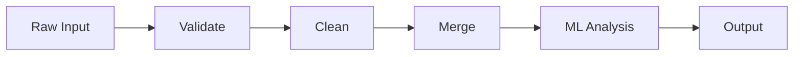

# Excel Utility Hub

A Python toolkit for validating, cleaning, merging, and analysing Excel-based data pipelines.

[](https://github.com/Dustin2304/excel-utility-hub/actions/workflows/ci.yml)

---

## Problem

Excel files arriving from external sources rarely conform to what downstream code expects. Column names change, types are inconsistent, values fall outside valid ranges, and duplicates accumulate silently. Catching these problems at the point of ingestion — before any transformation or analysis runs — prevents corrupted results from propagating. This toolkit provides a structured way to declare what a DataFrame must look like and get a precise report of every deviation from that contract.

---

## Features

**Case A — Schema Validator**

- Detects missing and unexpected columns
- Flags null values in non-nullable columns, with row-level indices
- Checks Python-native types per column (int, float, str, bool)
- Enforces numeric `min_value` / `max_value` bounds; boundary values pass
- Validates against an explicit `allowed_values` list
- Returns a structured `ValidationReport` — never raises, never prints

**Case B — Duplicate Handler**

- Four configurable strategies: `DROP_FIRST`, `DROP_LAST`, `FLAG`, `MERGE_AGGREGATE`
- Multi-column duplicate detection via `subset`
- `FLAG` adds an `is_duplicate` column without removing rows
- `MERGE_AGGREGATE` sums numeric columns and keeps first non-numeric value
- Returns a `DedupReport` with counts and the strategy used

**Case C — Multi-Source Merger**

- Loads, validates, and merges multiple Excel sources via `ExcelSource` definitions
- Per-source `column_mapping` for reconciling foreign column names
- Three conflict strategies: `LAST_WINS`, `FIRST_WINS`, `RAISE`
- Each source is validated against its own schema before merging
- Returns a `MergeReport` (and `load_and_merge_sources` returns the DataFrame too)

**Case D — Outlier Detection**

- Three methods: `IQR` (fast, no ML), `ZSCORE` (classic), `ISOLATION_FOREST` (sklearn)
- IQR for normally distributed data, ZSCORE when extreme values matter,
  IsolationForest for high-dimensional data without normality assumptions
- Multi-column detection
- Returns an `OutlierReport` with row indices of flagged rows

**Pipeline Runner & CLI**

- `run_pipeline(PipelineConfig)` orchestrates: validate → merge → dedupe → outliers
- YAML-driven CLI: `python -m src.cli.main --config docs/example_config.yaml`
- `PipelineReport` summarises every stage

---

## Data Flow



---

## Architecture

The codebase is split into two layers that are kept strictly separate.

`src/core/` contains all business logic: validation rules, deduplication strategies, merge logic, and ML analysis. Almost every function is a pure transformation — data in, result out, no side effects. The one deliberate exception is `merger.py`, which must read Excel files by design; all other modules are side-effect-free and tested with inline `pd.DataFrame` construction. Tests for the merger and pipeline use temporary files via pytest's `tmp_path` fixture because file I/O there is unavoidable.

`src/cli/` is the only adapter that touches the outside world. It parses arguments, reads the YAML config, calls `core/`, and formats output. The CLI is thin by design: if logic creeps in here, it cannot be unit-tested without invoking the full process.

This separation makes the test suite fast and deterministic, and it makes it possible to add a dashboard or API adapter later without touching any core logic.

---

## Tech Stack

| Tool | Why |
|---|---|
| Python 3.11 | Match-statement, `X \| Y` union types, performant |
| pandas >= 2.0 | Standard for tabular data; copy-on-write semantics in 2.x |
| scikit-learn >= 1.3 | Outlier detection in Case D |
| pytest + pytest-cov | Parametrized tests, coverage reporting |
| ruff | Fast linter and import sorter; replaces flake8 + isort |
| mypy (strict) | Catches type errors before runtime |
| GitHub Actions | CI on every push and PR |
| Docker | Reproducible execution environment (planned) |

---

## Installation

```bash
git clone https://github.com/Dustin2304/excel-utility-hub.git
cd excel-utility-hub

python -m venv .venv
source .venv/bin/activate

pip install -e .
pip install ruff mypy pytest pytest-cov
```

The editable install (`-e .`) puts `src/` on the Python path so scripts run without setting `PYTHONPATH`.

---

## Usage

```python
import pandas as pd
from src.core.models import ColumnSchema, DType, Schema
from src.core.validator import validate_against_schema

schema = Schema(columns=[
    ColumnSchema(name="name",  dtype=DType.STRING,  nullable=False),
    ColumnSchema(name="score", dtype=DType.FLOAT,   nullable=False,
                 min_value=0.0, max_value=100.0),
    ColumnSchema(name="grade", dtype=DType.STRING,  nullable=True,
                 allowed_values=["A", "B", "C", "D", "F"]),
])

df = pd.DataFrame({
    "name":  ["Alice", None],
    "score": [85.0, 150.0],
    "grade": ["A", "X"],
})

report = validate_against_schema(df, schema)
print(report.summary)
# Validation failed with 3 violation(s): nullable, max_value, allowed_values

for v in report.violations:
    print(f"[{v.rule}] {v.column} — rows {v.row_indices}: {v.message}")
```

Or run a full pipeline from a YAML config:

```bash
python -m src.cli.main --config docs/example_config.yaml
```

---

## Running Tests

```bash
# All checks must pass before committing
ruff check src/ tests/
mypy src/
pytest tests/ --cov=src --cov-report=term-missing
```

---

## Project Status

| Case | Description | Status |
|---|---|---|
| A | Schema Validator | Done |
| B | Duplicate Handler | Done |
| C | Multi-source Merger | Done |
| D | ML Outlier Detection | Done |
| — | Pipeline Runner | Done |
| — | CLI | Done |
| — | Dashboard | Planned |

---

## License

MIT
